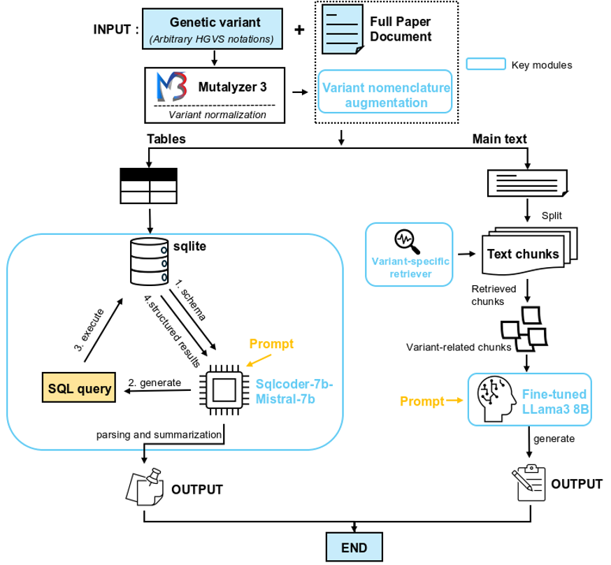

# AutoPM3：基于 LLM 驱动的 PM3 证据提取，增强变异解读

[English](./README.md) | **简体中文**

[](https://opensource.org/license/mit/)
[](https://doi.org/10.5281/zenodo.15629003)


联系方式：Ruibang Luo、Shumin Li

邮箱：rbluo@cs.hku.hk、lishumin@connect.hku.hk


## 简介
我们提出 AutoPM3，一种利用开源大语言模型（LLM）从科学文献中自动提取 ACMG/AMP PM3 证据的方法。它结合了面向文本理解的优化版 RAG 系统和配备 Text2SQL 的 TableLLM 用于数据抽取。我们使用自建的 PM3-Bench（在 ClinGen 证据库基础上构建，包含 1,027 个变异-文献配对）评估了 AutoPM3；得益于四大关键模块，它在变异命中和反式变异识别上显著优于其他方法。此外，我们为 AutoPM3 封装了用户友好的界面以提高易用性。本研究为提升罕见病诊断流程提供了有力工具，能更高效地从科学文献中提取 PM3 相关证据。

AutoPM3 的算法与结果描述已发表在 [Bioinformatics](https://academic.oup.com/bioinformatics/article/41/7/btaf382/8178584)。


---

## 项目结构

> **说明**：本仓库的顶层目录结构做过一次重构，原版是单层布局（源 `.py` 文件、`Dockerfile`、数据、文档全部平铺在根目录）。现在 Python 源码统一在 `app/`、运行期数据在 `data/`、Docker 相关在 `docker/`、凭据在 `config/`，基准评测和内部文档也各自有了独立目录。完整部署指南见 [DEPLOY.md](DEPLOY.md)。

```
AutoPM3/
├── app/                       # 全部 Python 源码（可安装的包）
│   ├── main.py                # Streamlit 入口——DeepSeek 页面
│   ├── pages/                 # 其它 Streamlit 页面（如 OpenAI 兼容页面）
│   ├── core/                  # 核心逻辑：查询引擎、表格抽取、工具函数
│   ├── data_io/               # 离线脚本（如 download_papers.py）
│   └── mineru/                # MinerU API 客户端（PDF → 结构化文本）
│
├── data/                      # 运行期数据文件
│   ├── protein.txt            # 蛋白缩写映射（由 app/core/query.py 加载）
│   ├── xml_papers/            # `python -m app.data_io.download_papers` 的输出（已 gitignore）
│   └── pdf_convert/           # MinerU 转换示例
│
├── benchmarks/                # PM3-Bench 评测数据集 + 使用说明
│
├── docs/                      # 内部文档（架构图、开发计划、会议纪要、图片）
│
├── scripts/build.sh           # 版本化 Docker 构建脚本（OCI 标签、semver tag）
│
├── docker/                    # Dockerfile + docker-compose.yml
│
├── config/                    # 凭据模板（`.env.example`、`secrets.toml.example`）
│                             #  —— 复制为 `config/.env` / `.streamlit/secrets.toml` 后使用
│
├── DEPLOY.md                  # 本地运行 + Docker + `scripts/build.sh` 全流程
├── requirements.txt
└── README.md
```

**关键路径约定**（完整列表见 [DEPLOY.md §0](DEPLOY.md#0-项目结构速览)）：
- 命令都在 **项目根** 下执行——`streamlit run app/main.py`、`python -m app.core.query` 等。
- 真实的 `secrets.toml` 放在 **`.streamlit/secrets.toml`**（Streamlit 默认搜索路径），模板在 `config/.streamlit/secrets.toml.example`。
- Docker 的 build context 是 **项目根**（不是 `docker/`）；`scripts/build.sh` 从脚本自身位置解析项目根，所以从任何 CWD 跑都能找对。

---

## 目录

- [项目结构](#项目结构)
- [最新更新](#最新更新)
- [在线 Demo](#在线-demo)
- [安装](#安装)
    - [依赖安装](#依赖安装)
    - [使用 Ollama 托管 LLM](#使用-ollama-托管-llm)
- [使用](#使用)
    - [快速开始](#快速开始)
    - [Python 脚本的高级用法](#python-脚本的高级用法)
- [PM3-Bench](#pm3-bench)
- [TODO](#todo)
---

## 最新更新
* v0.1（2024 年 10 月）：首次发布。
---
## 在线 Demo
* 在线体验：[AutoPM3-demo](https://www.bio8.cs.hku.hk/autopm3-demo/)。请注意，由于算力资源有限，建议本地部署 AutoPM3 以避免长时间排队。
## 安装
### 依赖安装
```bash
conda create -n AutoPM3 python=3.10
conda activate AutoPM3
pip3 install -r requirements.txt
```

### 使用 Ollama 托管 LLM
1. 下载 Ollama：[官方指南](https://github.com/ollama/ollama)
2. 修改 Ollama 模型目录：
```bash
# 请按需修改目标文件夹
mkdir ollama_models
export OLLAMA_MODELS=./ollama_models
```


```bash

ollama serve

```

3. 下载 sqlcoder-mistral-7B 模型和微调后的 Llama3：
```bash
cd $OLLAMA_MODELS
wget https://huggingface.co/MaziyarPanahi/sqlcoder-7b-Mistral-7B-Instruct-v0.2-slerp-GGUF/resolve/main/sqlcoder-7b-Mistral-7B-Instruct-v0.2-slerp.Q8_0.gguf?download=true
mv 'sqlcoder-7b-Mistral-7B-Instruct-v0.2-slerp.Q8_0.gguf?download=true' 'sqlcoder-7b-Mistral-7B-Instruct-v0.2-slerp.Q8_0.gguf'
echo "FROM ./sqlcoder-7b-Mistral-7B-Instruct-v0.2-slerp.Q8_0.gguf" >Modelfile1
ollama create sqlcoder-7b-Mistral-7B-Instruct-v0.2-slerp -f Modelfile1

wget http://bio8.cs.hku.hk/AutoPM3/llama3_loraFT-8b-f16.gguf
echo "FROM ./llama3_loraFT-8b-f16.gguf" >Modelfile2
ollama create llama3_loraFT-8b-f16 -f Modelfile2

```

5. 查看已创建的模型：

```bash

ollama list

```

6. （可选）下载其他模型作为 RAG 系统的后端：
```
# 例如下载 Llama3:70B
ollama pull llama3:70B

```

## 使用

### 快速开始

* 第 1 步：启动本地 Web 服务：
```bash
streamlit run app/main.py
```
* 第 2 步：把 `http://localhost:8501` 复制到浏览器，开始使用。

### Python 脚本的高级用法

* 查看 `app.core.query` 的帮助：
```bash
python -m app.core.query -h
```
* 运行 Python 脚本的示例：
```bash
python -m app.core.query
--query_variant "NM_004004.5:c.516G>C" ## HVGS 格式的查询变异
--paper_path ./data/xml_papers/20201936.xml ## 文献路径
--model_name_text llama3_loraFT-8b-f16 ## 按需换成 llama3:70b 或其他 Ollama 托管模型作 RAG 后端，注意需要在 Ollama 中先 pull
```

## PM3-Bench
* 我们公开了研究中使用的 PM3-Bench，详见 [PM3-Bench 教程](benchmarks/README.md)。

## TODO
* 一键快速部署 AutoPM3。
